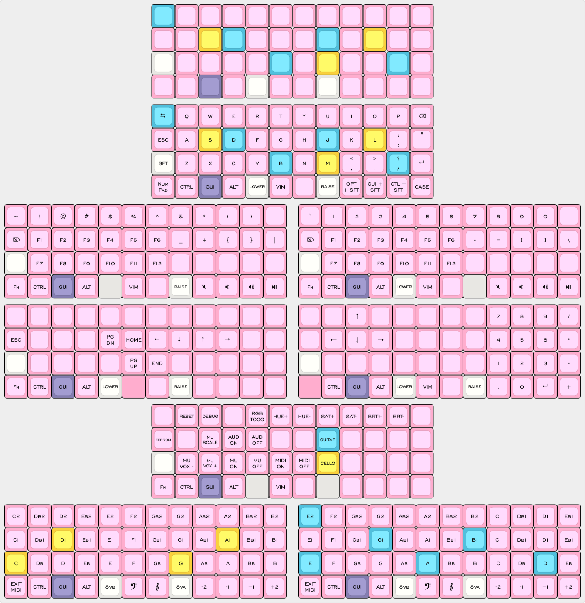

# my planck layout

Used mostly for writing, light coding, and sometimes as MIDI input for
arrangement and scoring (not production). Compiled on Alpine Linux with
`qmk-cli`, but flashed on macOS QMK Toolbox since the CLI didn't believe it was
in DFU mode.

### hardware

Drop + OLK Planck v7, polycarbonate case and steel switch plate, Gateron KS-3
Milk Yellow Pros

## layers

- **QWERTY base**. Not too different from the default, but I replaced the arrows
    wth shifted modifiers, a small godsend in switching between different OSes.
    On Mac, `Option + shift` gets me unicode characters I have yet to figure
    out for Linux, and on Linux `GUI + shift` makes window management easy.
- **Numbers and symbols** have nothing too crazy going on.
- **Vim navigation**. I see a lot of people put the home, end and page buttons
    in home row, but this bothers me deeply. Here I approximate actual Vim
    shortcuts (`Ctrl + f`, `Ctrl + b`), though N for End is a bit random due to
    gg and G.
- **Function and nunmpad**. I don't think I even use functions on my MacBook
    Air, but never say never. The numpad is more of a necessity since I write
    knitting patterns and type out hex codes for some reason.
- **Keyboard settings** also aren't too different from the default. I added an
    EEPROM reset key and removed RBG mode since it seems the rev7 only has one.
    The rest is MIDI.
- **MIDI layers**. The documentation for MIDI is quite sparse. I wrongly assumed
    the keycodes follow scientific pitch and only noticed later they stop at
    `MI_Fs5`, so I have this pitch shift palette to quickly put me in bass or
    treble octaves. I only plan to use this for notation, so I don't know how
    this setup would work for a digital producer.
