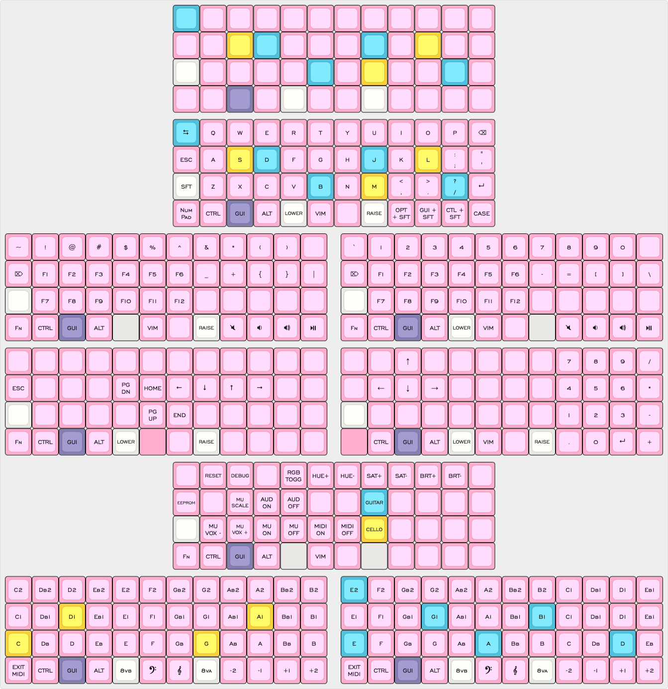

# my planck layout

Primarly used for writing, light coding, and MIDI input for notation (not
producution). Compiled on ALpine Linux with `qmk-cli` and flashed on QMK Toolbox
for macOS.

### hardware

Drop + OLK Planck v7, polycarbonate case and steel switch plate, Gateron KS-3
Milk Yellow Pros, keycaps from [Jesse Shipe (DIY Keyboards)](https://www.diykeyboards.com/).

## layers

- The first three layers aren’t too different from the default, except I replaced the arrows on base to shifted modifiers, super useful for switciing
    between systems for special characters on Mac and window management on
    Linux.
- **Vim navigation**. I see a lot of people put the home, end and page buttons
    in home row, but this bothers me deeply. Here I approximate actual Vim
    shortcuts (`Ctrl + f`, `Ctrl + b`), though N for End is a bit random due to
    gg and G.
- **Keyboard settings** also aren’t too different from the default. I added an
    EEPROM reset key and removed RBG mode since it seems the rev7 only has one.
    The rest is MIDI.
- **MIDI layers**. The documentation for MIDI is quite sparse. I wrongly assumed
    the keycodes follow scientific pitch and only noticed later they stop at
    `MI_Fs5`, so I have this pitch shift palette to quickly put me in bass or
    treble octaves. I only plan to use this for notation, so I don’t know how
    this setup would work for a digital producer.